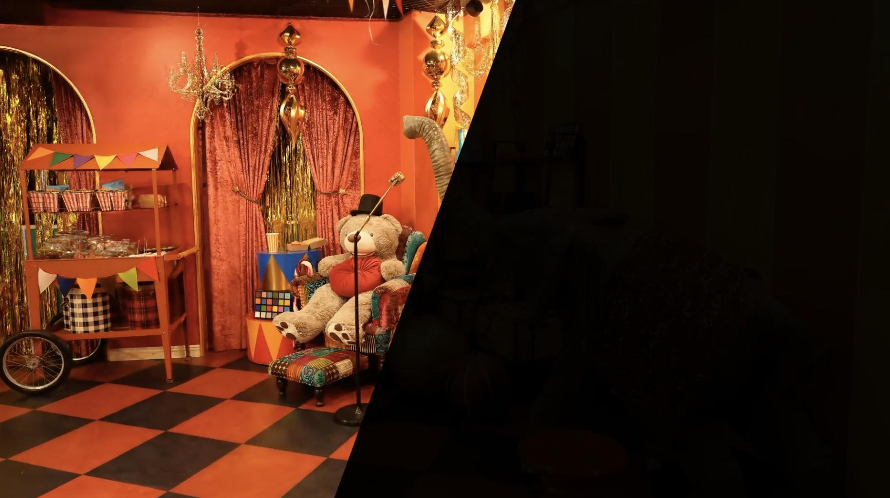
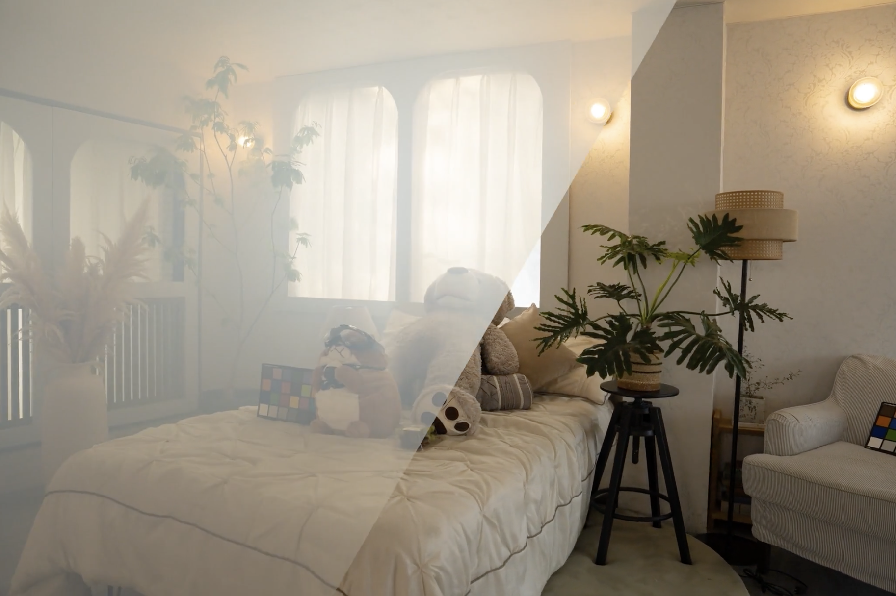

# 3D Restoration and Reconstruction  
## NTIRE 2026 Challenge

Organized by [Machine Intelligence Lab](https://www.mi.t.u-tokyo.ac.jp/en), University of Tokyo · [Interactive Content Design Lab](https://www.icd.riec.tohoku.ac.jp/en/), Tohoku University · [Computer Vision Lab](https://www.informatik.uni-wuerzburg.de/computervision/), University of Würzburg

---

## Overview

Welcome to the **1st 3D Restoration and Reconstruction Challenge** hosted at the [New Trends in Image Restoration and Enhancement (NTIRE) Workshop](https://cvlai.net/ntire/2026/), in conjunction with [CVPR 2026](https://cvpr.thecvf.com/).

This challenge aims to advance robust 3D reconstruction under real-world, in-the-wild degradations. Specifically, the proposed pipeline should account for realistic visual corruptions, restore degraded training views, and reconstruct clean 3D representations for high-quality novel-view synthesis (NVS).

To support this goal, we curate a comprehensive 3D benchmark, [RealX3D](https://arxiv.org/abs/2512.23437), and introduce **two tracks**:

1. **3D Low-Light Enhancement**
2. **3D Smoke Restoration**

Each track provides multiple scenes with multi-view images degraded by low-light or smoke, along with clean NVS references for evaluation. Submissions are assessed by comparing rendered NVS against the corresponding ground-truth captures. To simplify the evaluation protocol, both tracks focus on photometric fidelity, and the ground-truth camera poses of the training views are provided.

Participants are encouraged to approach this challenge from two key perspectives:

- **Better Visual Restoration:** novel designs or integrations of physical-aware visual restoration techniques for real-world visual corruptions.
- **Better Geometry Consistency:** novel designs of multi-view learning methods or 3D representations for in-the-wild 3D reconstruction.

Top-ranked participants will receive awards and be invited to present their solutions at the NTIRE workshop held in conjunction with CVPR 2026. The challenge results will also be published in the CVPR NTIRE 2026 workshop proceedings.

---

## Track 1: 3D Low-Light Enhancement Challenge

Low-light imaging is a long-standing challenge in 2D vision, where limited photons lead to severe noise, color shifts, and loss of fine textures, degrading both visual quality and downstream perception. While recent 2D low-light enhancement methods can produce visually pleasing results, they are often optimized for single images and may introduce view-dependent artifacts or hallucinated details.  
In real applications such as robotics, AR/VR, and autonomous systems, models must operate on multi-view observations and build a coherent 3D representation of the scene.  
This makes low-light enhancement fundamentally harder in 3D: the method must improve visibility while preserving cross-view consistency so that geometry and appearance remain stable when rendering novel views.  
The 3D Low-Light Enhancement Challenge targets this gap by encouraging approaches that bridge 2D enhancement and 3D multiview geometry, enabling reliable scene understanding and high-quality restoration and rendering under realistic low-light conditions.



### Data Structure

We provide one fully released scene containing both degraded and clean images for debugging and validation.   The development set includes 4 scenes, and performance is evaluated based on the submitted restored NVS results.   During the testing period, the test set of 3 scenes will be released and evaluated using the same protocol. All low-light images are captured with a shutter speed of 1/400, and the well-lit reference images are captured at 1/10 under same camera settings.  
Participants may use additional training data or pretrained models, provided that all external resources and training details are clearly documented in the final factsheet.

| Part | Scenes | Train Images | Train Poses | Test Images | Test Poses | Leaderboard |
|---|---:|:---:|:---:|:---:|:---:|---|
| Part I | 1 | ✅ | ✅ | ✅ | ✅ | Not evaluated |
| Part II | 4 | ✅ | ✅ | ❌ | ✅ | Development (immediate after submission) |
| Part III | 3 | ✅ | ✅ | ❌ | ✅ | Test (when testing begins) |

For each scene, the dataset is organized as follows:

```text
scene/
  train/
    0001.JPG
    0002.JPG
    ...
  transforms_train.json
  transforms_test.json
```
`transforms_train.json` and `transforms_test.json` follow the [Blender dataset format](https://docs.nerf.studio/quickstart/data_conventions.html) and include camera intrinsics and extrinsics (poses) for training views and NVS views to be submitted.

Examples of degraded and clean image pairs:

<p align="center">
  
  
  
  
</p>

---

## Track 2: 3D Smoke Restoration Challenge

Smoke-filled scenes pose a unique barrier to 3D vision because the degradation is not a simple image corruption but a physical process: scattering introduces a veil of stray light, reduces contrast non-uniformly with depth, and alters visibility in a view- and path-dependent manner.  
In real deployments such as firefighting robots, industrial inspection, search-and-rescue, and autonomous navigation in dust or smoke, perception systems must still localize, map, and recognize objects under severely degraded observations.  
The difficulty is amplified in multi-view settings, where the same surface can appear inconsistently across viewpoints due to varying optical thickness, occlusions from dense plumes, and spatially varying attenuation.  
The 3D Smoke Restoration Challenge targets robust recovery of scene geometry and appearance under participating media, aiming for methods that not only enhance visibility but also produce stable, physically plausible 3D reconstructions and coherent novel-view renderings in realistic scattering environments.



### Data Structure

We provide one fully released scene containing both degraded and clean images for debugging and validation.  The development set includes 4 scenes, and performance is evaluated based on the submitted restored NVS results.  During the testing period, the test set of 3 scenes will be released and evaluated using the same protocol.  In each scene, the degraded smoke views and clean ground-truth views are captured under same illumination and camera settings. Smoke density is controlled to be consistent across all scenes.  
Participants may use additional training data or pretrained models, provided that all external resources and training details are clearly documented in the final factsheet.

| Part | Scenes | Train Images | Train Poses | Test Images | Test Poses | Leaderboard |
|---|---:|:---:|:---:|:---:|:---:|---|
| Part I | 1 | ✅ | ✅ | ✅ | ✅ | Not evaluated |
| Part II | 4 | ✅ | ✅ | ❌ | ✅ | Development (immediate after submission) |
| Part III | 3 | ✅ | ✅ | ❌ | ✅ | Test (when testing begins) |

For each scene, the dataset is organized as follows:

```text
scene/
  train/
    0001.JPG
    0002.JPG
    ...
  transforms_train.json
  transforms_test.json
```
`transforms_train.json` and `transforms_test.json` follow the [Blender dataset format](https://docs.nerf.studio/quickstart/data_conventions.html) and include camera intrinsics and extrinsics (poses) for training views and NVS views to be submitted.

Examples of degraded and clean image pairs:

<p align="center">
  
  
  
  
</p>

---

## Evaluation

Participants are supposed to submit the restored NVS images given the testing view poses of each scene. We evaluate the rendered results against the clean ground-truth references using **PSNR**, **SSIM**, and **LPIPS**.  The final ranking is determined by the average per-scene performance across both the Development and Testing sets.

---

## Data Capture

Each frame in the RealX3D dataset provides a pair of degraded and clean images.  
To acquire these sequences, we used a mechanical rail-dolly system with constant camera speed. See the [Acquisition protocol](#acquisition-protocol) below for details.

---

## Organizer


<p align="left">
  <a href="https://shuhongll.github.io/">Shuhong Liu</a> (UTokyo) ·
  <a href="https://scholar.google.com/citations?user=4mg51BgAAAAJ&hl=en">Chenyu Bao</a> (UTokyo) ·
  <a href="https://cuiziteng.github.io/">Ziteng Cui</a> (UTokyo) ·
  <a href="https://sites.google.com/view/linguedu/home">Lin Gu</a> (Tohoku U) ·
  <a href="https://xg-chu.site/">Xuangeng Chu</a> (UTokyo) ·
  <a href="https://mv-lab.github.io/">Marcos V. Conde</a> (UWürzburg)
</p>

---

## RealX3D: A Physically-Degraded 3D Benchmark for Multi-view Visual Restoration and Reconstruction

[**ArXiv**](https://arxiv.org/abs/2512.23437) · **Data (release after challenge)**


RealX3D is a real-capture benchmark for multi-view visual restoration and 3D reconstruction under diverse physical degradations.  
Corruptions are grouped into four families—illumination, scattering, occlusion, and blurring—and captured at multiple severity levels using a unified acquisition protocol that yields pixel-aligned LQ/GT views.  
Each scene includes high-resolution capture, RAW images, and dense laser scans, from which we derive world-scale meshes and metric depth.


### Acquisition protocol

RealX3D provides 2,407 paired low-quality and reference images, along with the same number of corresponding RAW captures.  
The dataset is collected across 15 indoor rooms and organized into 55 distinct scenes spanning seven degradation types.  
The current release includes defocus or camera motion blur with 8 scenes and 271 pairs, where each scene is captured at two blur severity levels; dynamic occlusion with 8 scenes and 271 pairs; reflection with 8 scenes and 271 pairs; extreme low light with 9 scenes and 319 pairs; low-light exposure variation with 9 scenes and 319 pairs; and smoke scattering with 5 scenes and 143 pairs.  
We further provide laser-scanned point clouds with 5 mm point spacing, along with calibrated camera intrinsics and extrinsics.  
Each view is paired with a metric depth map stored as a 16-bit PNG in millimeters, and each scene includes a colored mesh reconstructed from the scanned point clouds.

---

## BibTeX

```bibtex
@article{liu2026realx3d,
  title={RealX3D: A Physically-Degraded 3D Benchmark for Multi-view Visual Restoration and Reconstruction},
  author={Liu, Shuhong and Bao, Chenyu and Cui, Ziteng and Liu, Yun and Chu, Xuangeng and Gu, Lin and Conde, Marcos V and Umagami, Ryo and Hashimoto, Tomohiro and Hu, Zijian and others},
  journal={arXiv preprint arXiv:2512.23437},
  year={2026}
}